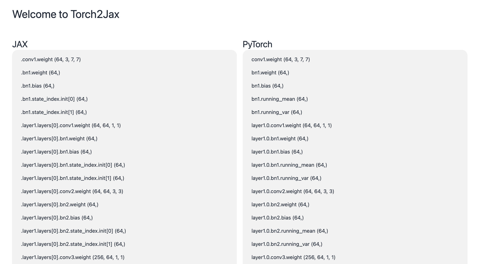

# statedict2pytree



The goal of this package is to simplify the conversion from PyTorch models into JAX PyTrees (which can be used e.g. in Equinox). The way this works is by putting both models side my side and aligning the weights in the right order. Then, all statedict2pytree is doing, is iterating over both lists and matching the weight matrices.

Usually, if you _declared the fields in the same order as in the PyTorch model_, you don't have to rearrange anything -- but the option is there if you need it.

(Theoretically, you can rearrange the model in any way you like - e.g. last layer as the first layer - as long as the shapes match!)

## Shape Matching? What's that?

Currently, there is no sophisticated shape matching in place. Two matrices are considered "matching" if the product of their shape match. For example:

1. (8, 1, 1) and (8, ) match, because (8 _ 1 _ 1 = 8)

## Get Started

### Installation

Run

```bash
pip install statedict2pytree

```

### Basic Example

```python
import equinox as eqx
import jax
import torch
import statedict2pytree as s2p


def test_mlp():
    in_size = 784
    out_size = 10
    width_size = 64
    depth = 2
    key = jax.random.PRNGKey(22)

    class EqxMLP(eqx.Module):
        mlp: eqx.nn.MLP
        batch_norm: eqx.nn.BatchNorm

        def __init__(self, in_size, out_size, width_size, depth, key):
            self.mlp = eqx.nn.MLP(in_size, out_size, width_size, depth, key=key)
            self.batch_norm = eqx.nn.BatchNorm(out_size, axis_name="batch")

        def __call__(self, x, state):
            return self.batch_norm(self.mlp(x), state)

    jax_model = EqxMLP(in_size, out_size, width_size, depth, key)

    class TorchMLP(torch.nn.Module):
        def __init__(self, in_size, out_size, width_size, depth):
            super(TorchMLP, self).__init__()
            self.layers = torch.nn.ModuleList()
            self.layers.append(torch.nn.Linear(in_size, width_size))
            for _ in range(depth - 1):
                self.layers.append(torch.nn.Linear(width_size, width_size))
            self.layers.append(torch.nn.Linear(width_size, out_size))
            self.batch_norm = torch.nn.BatchNorm1d(out_size)

        def forward(self, x):
            for layer in self.layers[:-1]:
                x = torch.relu(layer(x))
            x = self.batch_norm(self.layers[-1](x))
            return x

    torch_model = TorchMLP(in_size, out_size, width_size, depth)
    state_dict = torch_model.state_dict()
    s2p.start_conversion(jax_model, state_dict)


if __name__ == "__main__":
    test_mlp()

```

There exists also a function called `s2p.convert` which does the actual conversion:

```python

class Field(BaseModel):
    path: str
    shape: tuple[int, ...]


class TorchField(Field):
    pass


class JaxField(Field):
    type: str

def convert(
    jax_fields: list[JaxField],
    torch_fields: list[TorchField],
    pytree: PyTree,
    state_dict: dict,
):
...
```

If your models already have the right "order", then you might as well use this function directly. Note that the lists `jax_fields` and `torch_fields` must have the same length and each matching entry must have the same shape!

For the full, automatic experience, use `autoconvert`:

```python
import statedict2pytree as s2p

my_model = Model(...)
state_dict = ...

model, state = s2p.autoconvert(my_model, state_dict)

```

This will however only work if your PyTree fields have been declared
in the same order as they appear in the state dict!
