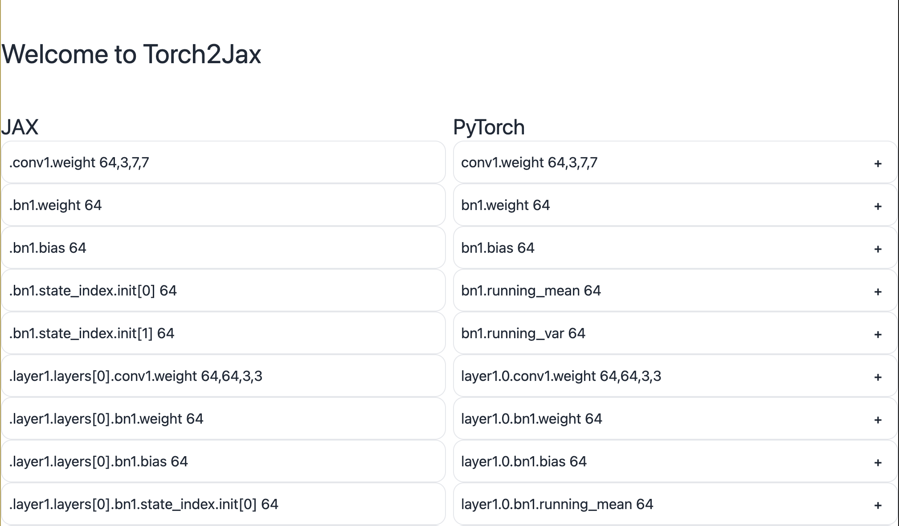

# statedict2pytree



## Docs

Docs can be found [here](https://artur-galstyan.github.io/statedict2pytree/).


## Important

This package is still in its infancy and hihgly experimental! The code works, but it's far from perfect. With more and more iterations, it will eventually become stable and well tested.
PRs and other contributions are *highly* welcome! :)

## Info

`statedict2pytree` is a powerful tool for converting PyTorch state dictionaries to JAX pytrees. It provides both programmatic and UI-based methods for mapping between PyTorch and JAX model parameters.

## Features

- Convert PyTorch statedicts to JAX pytrees
- Handle large models with chunked file conversion
- Provide an "intuitive-ish" UI for parameter mapping
- Support both in-memory and file-based conversions

## Installation

```bash
pip install statedict2pytree
```

The goal of this package is to simplify the conversion from PyTorch models into JAX PyTrees (which can be used e.g. in Equinox). The way this works is by putting both models side my side and aligning the weights in the right order. Then, all statedict2pytree is doing, is iterating over both lists and matching the weight matrices.

Usually, if you _declared the fields in the same order as in the PyTorch model_, you don't have to rearrange anything -- but the option is there if you need it.

(Theoretically, you can rearrange the model in any way you like - e.g. last layer as the first layer - as long as the shapes match!)

## Shape Matching? What's that?

Currently, there is no sophisticated shape matching in place. Two matrices are considered "matching" if the product of their shape match. For example:

(8, 1, 1) and (8, ) match, because (8 _ 1 _ 1 = 8)


### Disclaimer

Some of the docstrings and the docs have been written with the help of
Claude.
